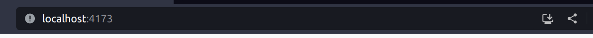
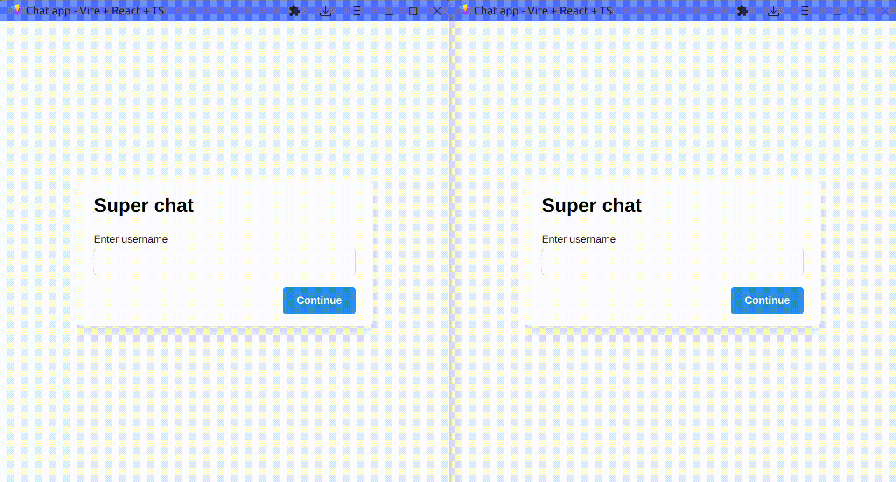

## Чат

### Запуск в dev режиме

```bash
npm i
npm run dev
```

### Для offline работы

```bash
npm i
npm run build
npm run preview
```

Перейти на сайт, затем можно остановить сервер, снова зайти на сайт и все будет работать без запущенного сервера.
Поскольку это веб-приложение является PWA, можно установить как отдельное приложение на устройство. Для этого нужно нажать на значок установки в адресной строке



Возможности:

-  Создание пользователя
-  Создание/удаление чата
-  Отправка сообщений
-  Поддержка emoji, цитирования сообщений, изображений
-  Удаление сообщений
-  Все данные сохраняются в IndexedDB

Особенности:

-  PWA, работа offline, возможность отедельной установки на устройтсво
-  Сообщения в разных вкладках в одинковых чатах синхронизируются в реальном времени с помощью BroadcastChannel
-  Вся логика реализована через IndexedDB, работа с ней происходит с помощью обертки [idb](https://github.com/jakearchibald/idb)
-  Для быстрой разработки ui использовался [mantine-ui](https://mantine.dev/)
-  Для роутинга и работой с данными использовался [react-router-dom](https://reactrouter.com)

Демо:



---

Задание: создать веб-приложение - локальный чат.

-  Чат должен работать без сервера, в рамках одного браузера
-  У каждой вкладки своя сессия
-  При в ходе в чат пользователь должен идентифицировать себя и комнату чата в которую он хочет войти
-  Данные чата должны сохраняться и восстанавливаться при входе пользователя в комнату
-  Данные пользователя и сообщения должны храниться локально и не удаляться при закрытии браузера

Будет плюсом если реализуете:

-  Отображение emoji
-  Цитирование сообщений
-  Поддержка медиа-контента

Требования

-  Приложение написано на React
-  Использован JS или TS
-  Работоспособность в последней версии Google Chrome
-  Зависимости не хранятся в проекте
-  Проект запускается и работает после выполнения команд npm install и npm run start, или присутствует инструкция для запуска
